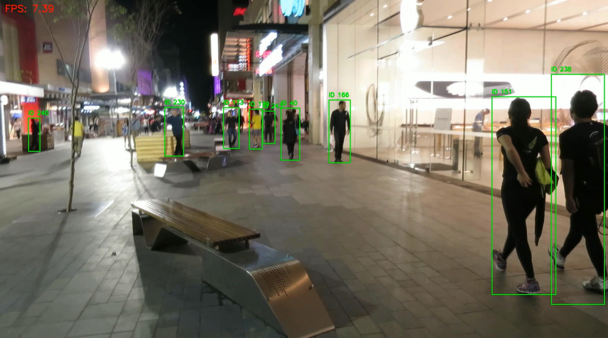

# MOT17 – Detection & Tracking with YOLO and SORT

## Overview
This project implements a real-time multi-object tracking pipeline combining a CNN-based detector (YOLOv8) with the SORT tracking algorithm.

## Pipeline
1. Frame loading from MOT17 sequences
2. Person detection using YOLOv8 (PyTorch backend)
3. Multi-object tracking with SORT
4. Real-time visualization and FPS measurement

## Technologies
- PyTorch
- YOLOv8 (Ultralytics)
- OpenCV
- SORT
- MOT17 dataset

## Expected output

Below are qualitative visual results of running YOLOv8n and YOLOv8s on the MOT17-02-FRCNN sequence.

  
  

  <b>Left:</b> YOLOv8n + SORT &nbsp;&nbsp; | &nbsp;&nbsp;
  <b>Right:</b> YOLOv8s + SORT

## Results
- Real-time performance: ~XX FPS (YOLOv8n)
- Improved ID stability with YOLOv8s
- Robust tracking under moderate occlusions

## Dataset
MOT17 dataset (not included in this repository)

## Future Work
- DeepSORT integration
- Tracking metrics (MOTA, ID switches)
- Edge deployment

## Model Comparison

I compared the behaviour of YOLOv8n and YOLOv8s as person detectors in a SORT-based multi-object tracking pipeline using the MOT17 dataset.

Although it is generally expected that a stronger detector improves identity stability, our results show that YOLOv8s produced a higher number of unique IDs compared to YOLOv8n.

This behavior can be explained by the increased detection capacity of YOLOv8s. The model is able to detect more pedestrians, including smaller and partially occluded individuals, which leads to the creation of additional tracks. While this increases the total number of unique IDs, it does not necessarily indicate worse tracking performance, but rather a more complete detection of the scene.

Additionally, the higher detection sensitivity of YOLOv8s can introduce short-lived tracks for difficult detections, which further contributes to the total ID count.

| Model   | Avg FPS | Unique IDs |
|---------|---------|------------|
| YOLOv8n | 10.28    | 182         |
| YOLOv8s | 7.59    | 209         |

This values were obtained by evaluating the models with the MOT17-02-FRCNN video

The experiment demonstrates the trade-off between speed, detection coverage, and identity stability in real-time multi-object tracking systems.
